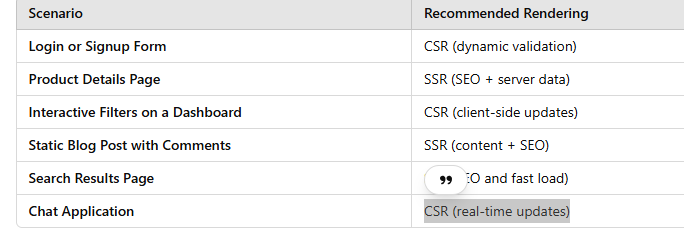
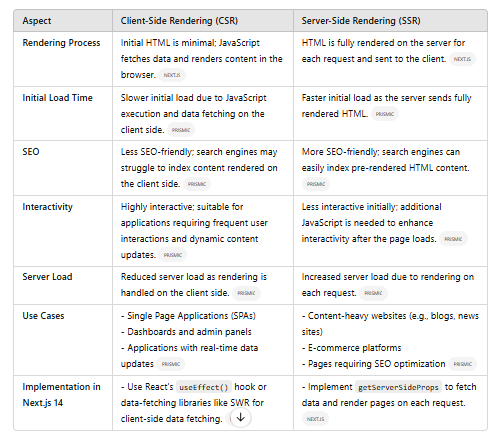

# Next.js First Class README

## Overview

Next.js is a React framework that enables you to build server-side rendered and static web applications with ease. It combines the best features of React with tools to enhance SEO, performance, and scalability.

---

## Client-Side Rendering (CSR) vs. Server-Side Rendering (SSR)

Understanding the difference between Client-Side Rendering and Server-Side Rendering is crucial in Next.js. Below is a visual comparison:

### **Comparison of CSR vs. SSR**
(Refer to the attached images for details.)

#### **Scenario-Based Recommendations**


#### **Detailed Differences**


---

## Key Features of Next.js Over React

### **1. Built-In Routing**
- Unlike React, Next.js has file-based routing. Each file in the `pages` directory automatically becomes a route.

### **2. Server-Side Rendering (SSR) and Static Site Generation (SSG)**
- Next.js supports SSR and SSG out of the box, allowing for better performance and SEO.

### **3. Optimized Image Handling**
- Use the `next/image` component for automatic image optimization, resizing, and lazy loading.

### **4. CSS and Styling**
- Supports CSS-in-JS, Sass, and other styling solutions directly integrated with your project.

### **5. Fast Refresh**
- Provides instant feedback during development by preserving component state while editing code.

### **6. TypeScript Support**
- Next.js has built-in TypeScript support for type-safe development.

---

## When to Choose CSR or SSR in Next.js

### Use **CSR** for:
- Real-time and highly interactive applications (e.g., chat apps, dashboards).
- Components or pages that don't need SEO optimization.
- Reducing server-side processing for frequent UI updates.

### Use **SSR** for:
- SEO-critical pages (e.g., blogs, e-commerce product pages).
- Content-heavy applications that require fast initial loads.
- Pre-filling forms with server-side data.

---

## Getting Started

1. Install Next.js:
   ```bash
   npx create-next-app@latest
   ```

2. Run Development Server:
   ```bash
   npm run dev
   ```

3. Access your app at:
   [http://localhost:3000](http://localhost:3000)

---

## Contributing
Feel free to add more features or suggest improvements for this repository. Contributions are always welcome!

